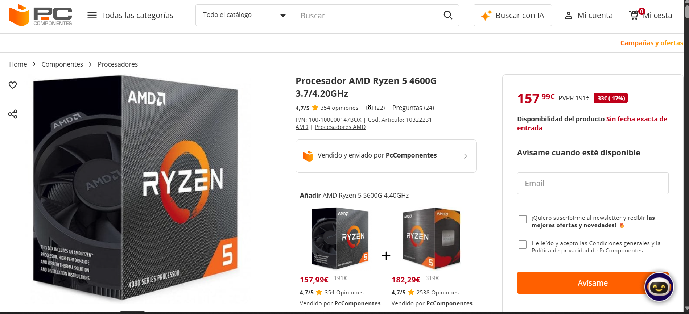
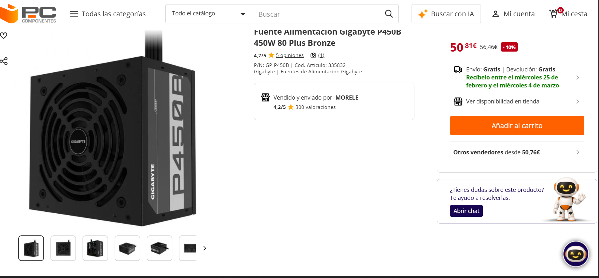
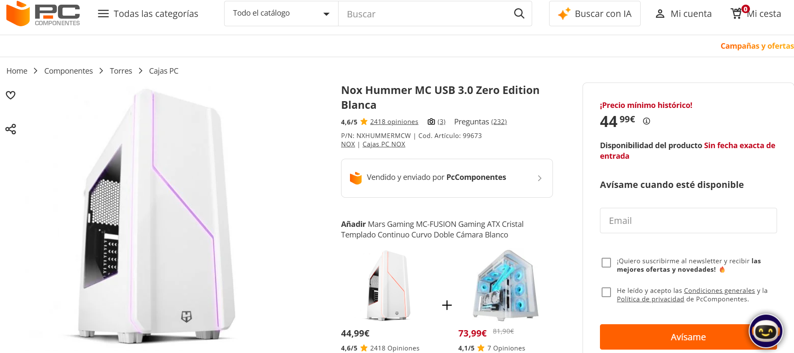

# Opción A — PC de oficina por piezas (PASO 1–7)

> Rellena cada paso usando la **plantilla**. Mantén el objetivo: **oficina**, precio ajustado y componentes razonables.

## PASO 1 — CPU con gráficos integrados
PASO 1 — Procesador

Componente elegido:  **AMD Ryzen 5 4600G**

Marca y modelo:  **AMD Ryzen 5 4600G**

Precio (€):  **157,99 €**

URL tienda:

[Procesador](https://www.pccomponentes.com/procesador-amd-ryzen-5-4600g-37-420ghz)

Ficha técnica oficial :

[AMD Ryzen5 4600G](https://www.amd.com/en/support/downloads/drivers.html/processors/ryzen/ryzen-4000-series/amd-ryzen-5-4600g.html)

URL oficial (fabricante/estándar):

[AMD Ryzen5 4600G](https://www.amd.com/en/support/downloads/drivers.html/processors/ryzen/ryzen-4000-series/amd-ryzen-5-4600g.html)

Características principales :

• **CPU 6 núcleos / 12 hilos**

• **Frecuencia base 3,7 GHz / turbo hasta 4,2 GHz**

• **Gráfica integrada Radeon**

• **TDP 65 W**

• **Soporta DDR4-3200**

Justificación (oficina):

**Este procesador ofrece un rendimiento sólido para tareas de ofimática, navegación con muchas pestañas, edición ligera de documentos y vídeos, videoconferencias, etc. Sus gráficos integrados evitan la necesidad de una GPU dedicada, reduciendo consumo, ruido y coste.**

Compatibilidad :

• Compatibilidad con placa base AM4
→ Evidencia: [Procesador](https://www.pccomponentes.com/procesador-amd-ryzen-5-4600g-37-420ghz)

• Soporta DDR4
→ Evidencia: [Procesador](https://www.pccomponentes.com/procesador-amd-ryzen-5-4600g-37-420ghz)

Captura: 
 

 
## PASO 2 — Placa base compatible

Componente elegido: **MSI A520M-A PRO**

Marca y modelo:  **MSI A520M-A PRO Micro-ATX**

Precio (€): **51.99 €**

URL tienda:  **[PlacaBase](https://www.pccomponentes.com/msi-a520m-a-pro)**

Ficha técnica oficial : [MSI](https://es.msi.com/Motherboard/A520M-A-PRO)

URL oficial (fabricante/estándar): [MSI](https://es.msi.com/Motherboard/A520M-A-PRO)

Características principales:

**• Socket AM4**

**• Chipset A520**

**• Formato Micro-ATX**

**• 1× M.2 NVMe (PCIe 3.0)**

**• Soporta DDR4 hasta 3200 MHz**

Justificación (oficina):

**Placa económica compatible con procesadores Ryzen con gráfica integrada. Permite montar un sistema eficiente para oficina, con soporte para SSD NVMe, RAM rápida y ampliación futura.**

Compatibilidad:

• Socket AM4 para Ryzen 5 4600G
• Slot M.2 NVMe para SSD

Evidencia: [PlacaBase](https://www.pccomponentes.com/msi-a520m-a-pro)

Captura: 
 

## PASO 3 — Memoria RAM (mínimo 8 GB)

Componente elegido:  **Kingston Fury Beast RGB 8 GB DDR4-3200**

Marca y modelo:  **Kingston Fury Beast RGB 8 GB DDR4-3200**

Precio (€): **40.72€**

URL tienda: [RAM](https://www.carrefour.es/kingston-technology-fury-beast-rgb-special-edition-modulo-de-memoria-8-gb-1-x-8-gb-ddr4-3200-mhz/0740617330403/p?srsltid=AfmBOoqjp_i5u_cx_p9_U5Amu3SLKLPDrWqOPMpd1UigS2t5Qhnd8KvlqDw)

Ficha técnica oficial :**[Ficha Tecnica DDR4](https://www.kingston.com/datasheets/KF432C16BB2A_8.pdf)**

URL oficial (fabricante/estándar): **[Ficha Tecnica DDR4](https://www.kingston.com/datasheets/KF432C16BB2A_8.pdf)**

Características principales:
**• DDR4**

**• 8 GB**

**• 3200 MHz**

Justificación (oficina):

**8 GB de RAM permite realizar múltiples tareas básicas de oficina, múltiples pestañas de navegador y programas como Word y Excel. DDR4-3200 es soportado por la placa y el procesador para un rendimiento adecuado.**

Compatibilidad :
• DDR4 compatible con placa MSI A520M-A PRO
• Soporta hasta 3200 MHz y compatible con Ryzen 4600G

[Ficha Tecnica DDR4](https://www.kingston.com/datasheets/KF432C16BB2A_8.pdf)

Captura:

 

## PASO 4 — Almacenamiento (SSD)

Componente elegido:  **Crucial P3 500 GB**

Marca y modelo:  **Crucial P3 500 GB NVMe M.2**

Precio (€): **49.99 €**

URL tienda:

**[SSD](https://www.carrefour.es/disco-duro-micron-ct500p3ssd8-500-gb/0649528918758/p?srsltid=AfmBOoqNQcJEsAGrGwVRlULdXzWNxKHT-yaVxc1vtt1miZIdcK6GbKFTQ04)**

Ficha técnica oficial :

[FTMicron](https://www.crucial.es/ssd/p3/ct500p3ssd8) 

URL oficial (fabricante/estándar):

[FTMicron](https://www.crucial.es/ssd/p3/ct500p3ssd8) 

Características principales:

**• 500 GB**

**• NVMe PCIe 3.0**

**• M.2 2280**

Justificación (oficina):

**El SSD M.2 NVMe proporciona arranque rápido del sistema operativo y tiempos de carga reducidos en aplicaciones de uso común, importante para productividad diaria.**

Compatibilidad:
**• Slot M.2 PCIe 3.0 en placa MSI A520M-A PRO**

**• Soporta NVMe PCIe 3.0**

[FTMicron](https://www.crucial.es/ssd/p3/ct500p3ssd8) 

Captura:

 

## PASO 5 — Fuente (PSU)

Componente elegido:  **Gigabyte P450B 450W 80+ Bronze**

Marca y modelo:  **Gigabyte P450B 450W 80+ Bronze**

Precio (€):  **50.81 €**

URL tienda:

[FuenteAl](https://www.pccomponentes.com/gigabyte-p450b-450w-80-plus-bronze?utm_source=google&utm_medium=free-listings&srsltid=AfmBOooBEmG4QYYe2rss4fl0OJ_mPlWg02l9cJdo2CkZee0exfPoAe0nWFI)

Ficha técnica oficial (obligatorio):

[FT FAlim.](https://www.gigabyte.com/es/Power-Supply/GP-P450B)

URL oficial (fabricante/estándar):

[FT FAlim.](https://www.gigabyte.com/es/Power-Supply/GP-P450B)

Características principales (resumen):

**• 450 W**

**• 80+ Bronze**

**• Conectores ATX 24 pin + CPU 8 pin**

Justificación (oficina):

**450 W es más que suficiente para un equipo sin tarjeta gráfica dedicada, con consumo controlado y eficiencia energética adecuada para oficina.**

Compatibilidad (obligatorio, con enlaces):

**• Conectores ATX estándar para placa y CPU**

**• Potencia suficiente para CPU Ryzen 5 4600G + SSD + RAM**

Enlace: [FT FAlim.](https://www.gigabyte.com/es/Power-Supply/GP-P450B)

Captura:

 

## PASO 6 — Chasis

Componente elegido: **Nox Hummer MC USB 3.0 Zero Edition**

Marca y modelo: **Nox Hummer MC USB 3.0 Zero Edition**

Precio (€):  **44.99 €**

URL tienda:

[Chasis](https://www.pccomponentes.com/nox-hummer-mc-usb-30-zero-edition-blanca?srsltid=AfmBOopxCrm7vmUX5TJKPNiyiUCmGrotJLdfbBHHuAH2h8F4_XZG-KRWIRE)

Ficha técnica oficial (obligatorio):

[FTChasis](https://www.nox-xtreme.com/cajas/hummer-mc-zero-edition)

URL oficial (fabricante/estándar):

[FTChasis](https://www.nox-xtreme.com/cajas/hummer-mc-zero-edition)

Características principales :

**• Formato Micro-ATX**

**• USB 3.0 frontal**

**• Compatible con PSU ATX**

Justificación (oficina):

**Caja sencilla, compatible con la placa Micro-ATX y la fuente estándar. Buena ventilación para un sistema de baja potencia, ideal para entornos de trabajo.**

Compatibilidad (obligatorio, con enlaces):
• Soporta placas Micro-ATX

• Compatible con fuente ATX

[FTChasis](https://www.nox-xtreme.com/cajas/hummer-mc-zero-edition)

Captura: 

 

## PASO 7 — Presupuesto final
- Suma total de la Opción A (por piezas). --> 157.99 + 51.99 + 40.72 + 49.99 + 50.81 + 44.99 = **396.49€**

Principalmente, se intenta buscar la mejor relacion calidad-precio posible, pero siempre dejando la posibilidad de poder ampliar/mejorar los componentes (RAM, slot M.2 NVMe para añadir o cambiar SSD...) 

-  Mini tabla resumen.

| Componente | Modelo | Precio (€) | URL tienda |
|---|---|---:|---|
| CPU | AMD Ryzen 5 4600G | 157.99 | [Procesador](https://www.pccomponentes.com/procesador-amd-ryzen-5-4600g-37-420ghz)|
| Placa base | MSI A520M-A PRO | 51.99 |[PlacaBase](https://www.pccomponentes.com/msi-a520m-a-pro)|
| RAM | Kingston Fury Beast RGB 8 GB DDR4-3200 | 40.72 | [RAM](https://www.carrefour.es/kingston-technology-fury-beast-rgb-special-edition-modulo-de-memoria-8-gb-1-x-8-gb-ddr4-3200-mhz/0740617330403/p?srsltid=AfmBOoqjp_i5u_cx_p9_U5Amu3SLKLPDrWqOPMpd1UigS2t5Qhnd8KvlqDw)|
| SSD | Crucial P3 500 GB | 49.99 | [SSD](https://www.carrefour.es/disco-duro-micron-ct500p3ssd8-500-gb/0649528918758/p?srsltid=AfmBOoqNQcJEsAGrGwVRlULdXzWNxKHT-yaVxc1vtt1miZIdcK6GbKFTQ04) |
| PSU | Gigabyte P450B 450W 80+ Bronze | 50.81 | [FuenteAl](https://www.pccomponentes.com/gigabyte-p450b-450w-80-plus-bronze?utm_source=google&utm_medium=free-listings&srsltid=AfmBOooBEmG4QYYe2rss4fl0OJ_mPlWg02l9cJdo2CkZee0exfPoAe0nWFI) |
| Chasis | Nox Hummer MC USB 3.0 Zero Edition | 44.99 | [Chasis](https://www.pccomponentes.com/nox-hummer-mc-usb-30-zero-edition-blanca?srsltid=AfmBOopxCrm7vmUX5TJKPNiyiUCmGrotJLdfbBHHuAH2h8F4_XZG-KRWIRE) |
| **TOTAL** |  | **396.49€** |  |
